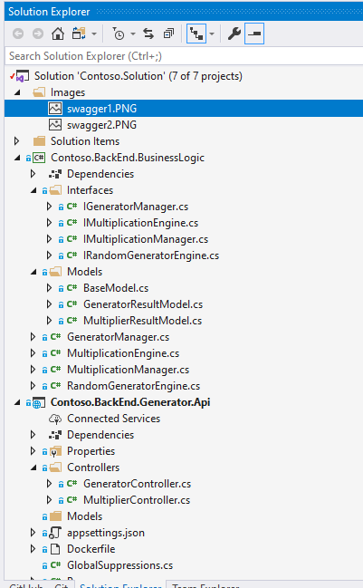
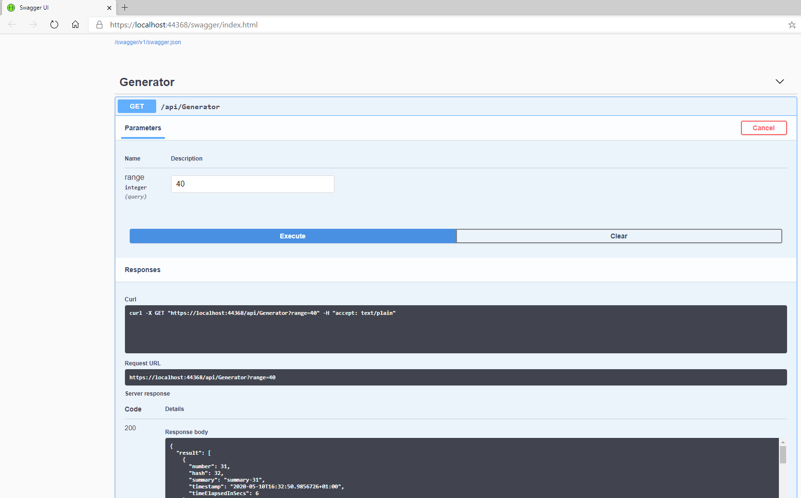
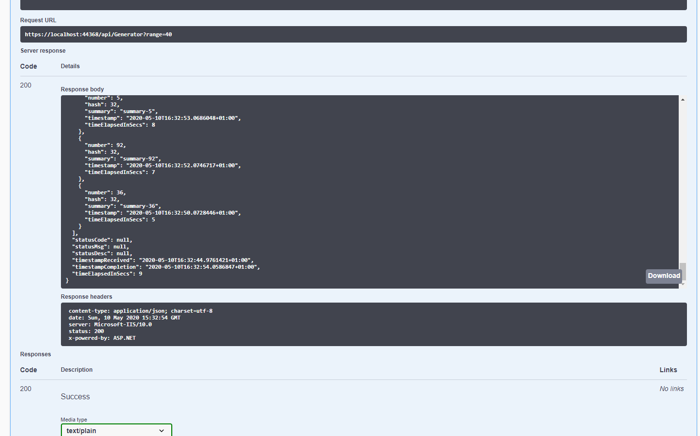

# Dotnet-Core-3.1-Microservice-Sample

As starter sample to build microservices with specific unit tests and ready to deployed in to Container.

### Software Requirements 

1. Visual Studio 2019 16.5 or above 
2. .NET Core SDK 3.1 
3. Nuget Package Manager 
4. SQL Server Express (Optional)

### Components 

Simple layered architecture 

1. **FrontEnd.Web** - Browser based client 
2. **Backend.BusinessLogic** - all necessary logic shared by Both API's
3. **Contoso.BackEnd.Processor.Api** - Backend API used by Frontend for subsequent operations 
4. **Contoso.BackEnd.Generator.Api** - Secondary API used by Backend API for batch processing etc. 
3. **Contoso.Core** - cross cutting concerns 
4. **Contoso.Data** - Entity Framework core implementation 
5. **Contoso.Tests** - Backend Unit test   

